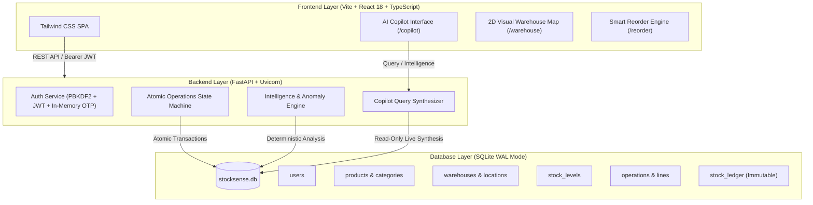

# 📦 StockSense — Modular Inventory Management & Intelligence Platform

[](https://react.dev/)
[](https://www.typescriptlang.org/)
[](https://vitejs.dev/)
[](https://tailwindcss.com/)
[](https://fastapi.tiangolo.com/)
[](https://www.python.org/)
[](https://www.sqlite.org/)
[](https://docs.pytest.org/)
[](https://vercel.com/)
[](https://render.com/)
[](https://odoo.com)

StockSense is a production-grade, real-time **Inventory Management System (IMS) & Warehouse Intelligence Platform** built for the **Odoo × GCET Hyderabad Hackathon 2026**. It combines strict double-entry stock conservation, multi-warehouse 2D spatial layouts, dynamic consumption forecasting, deterministic anomaly detection, and an interactive **AI Inventory Copilot**.

---

## 🔗 Quick Submission Links

| Resource | Link / Path | Description |
| :--- | :--- | :--- |
| 🚀 **Live Web Application** | [odoo-hackathon-frontend-gilt.vercel.app](https://odoo-hackathon-frontend-gilt.vercel.app/) | Deployed on Vercel CDN |
| 🎥 **1080p Walkthrough Video** | [Google Drive Video Stream](https://drive.google.com/file/d/1aqPKAQ6Ec6oFYYL2_MqHppOGoIc7fgT-/view?usp=drive_link) · [`stocksense_demo_walkthrough.mp4`](stocksense_demo_walkthrough.mp4) | High-definition 4-minute 12-scene full walkthrough |
| 📖 **Interactive API Swagger** | `http://localhost:8000/docs` | OpenAPI 3.0 interactive specification |
| 📂 **GitHub Repository** | [sathwik328/Odoo-Hackathon](https://github.com/sathwik328/Odoo-Hackathon) | Monorepo source code & test suites |

---

## 🔑 Hackathon Demo Evaluator Credentials

The login page features a **1-Click Demo Login** button that immediately authenticates evaluators with pre-seeded operational data:

| Role | Email | Password | Permissions |
| :--- | :--- | :--- | :--- |
| **Chief Logistics Officer (Admin)** | `admin@stocksense.com` | `Password@123` | Full access to all operations, catalog, reorders & anomalies |
| **Logistics Specialist (Operator)** | `operator@stocksense.com` | `Password@123` | Operational receipts, transfers & deliveries |

---

## 🌟 Key Platform Innovations

### 1. 🤖 AI Inventory Copilot (`/copilot`)
* Direct natural-language query assistant connected to live SQLite state.
* Instant evaluation of critical restock needs, stock availability across specific rack bins, pending inbound consignments, and operational anomalies.
* Quick-action prompt chips and deep-links directly into operational workflows.

### 2. 📉 Smart Reorder Intelligence (`/reorder`)
* **Dynamic Days Until Safety Stock (DUS)**:
  $$\text{DUS} = \frac{\text{Current Stock} - \text{Safety Stock}}{\text{Average Daily Usage (ADU)}}$$
* Evaluates consumption burn rates dynamically from historical validated deliveries—never hardcoded.
* Urgency categorizations (`CRITICAL`, `WARNING`, `HEALTHY`, `COLD_START`) with 1-click Purchase Draft PO generation.

### 3. 🛡️ Deterministic 3-Rule Anomaly Detection Engine (`/anomalies`)
* **Rule 1 (`UNUSUAL_VOLUME`)**: Flags single delivery spikes $> 3\times$ historical moving average.
* **Rule 2 (`HIGH_FREQUENCY_MOVEMENT`)**: Detects potential hoarding or conveyor bottlenecks ($> 5$ transfers within 10 minutes).
* **Rule 3 (`LARGE_ADJUSTMENT_VARIANCE`)**: Flags inventory shrinkage/damage cycle count adjustments exceeding $\pm 20\%$ variance.

### 4. 🗺️ Multi-Warehouse 2D Visual Rack Map (`/warehouse`)
* Interactive spatial visualizer mapping storage zones, receiving docks, staging bays, and rack shelves (`WH1-A1`, `WH1-A2`, `WH1-REC`, `WH1-STG`).
* Live capacity utilization percentages, color-coded occupancy thresholds, and click-to-inspect bin drawer.

### 5. 📑 Double-Entry Immutable Stock Ledger (`/ledger`)
* Strict transactional conservation: stock cannot appear or disappear without an atomic ledger record.
* **Negative Stock Prevention Guard**: Outbound deliveries that exceed on-hand balance in the source location are rejected with `400 Bad Request` (`INSUFFICIENT_STOCK`), guaranteeing ledger integrity.

---

## 📐 System Architecture



---

## 🧪 Comprehensive Verification Suite (27 / 27 Passed)

Our backend test suite validates all critical business rules, invariants, and edge cases:

```bash
cd backend
pytest -v
```

```text
tests/test_auth.py ......................... [Pass]
tests/test_catalog.py ...................... [Pass]
tests/test_dashboard_ledger.py ............. [Pass]
tests/test_intelligence.py ................. [Pass]
tests/test_inventory_core.py ............... [Pass]
tests/test_operations.py ................... [Pass]
====================== 27 passed in 2.12s ======================
```

* **Double-Entry Conservation**: Receipt intake + internal transfer maintains exact net inventory.
* **Negative Stock Protection**: Attempting to deliver 61 units from a location with 60 units rejects cleanly with `INSUFFICIENT_STOCK`.
* **Cycle Count Variance**: Count overrides update balances and record exact signed deltas.

---

## 💻 Local Quickstart

### 1. Backend Setup
```bash
cd backend
python -m venv .venv

# Windows:
.\.venv\Scripts\activate
# Linux / macOS:
source .venv/bin/activate

pip install -r requirements.txt

# Populate realistic multi-warehouse industrial scenario
python -m app.seeds.seed_data

# Launch FastAPI server
python -m uvicorn app.main:app --port 8000 --reload
```
API Swagger documentation is accessible at: `http://localhost:8000/docs`

### 2. Frontend Setup
```bash
cd frontend
npm install
npm run dev -- --host 127.0.0.1 --port 3000
```
Open `http://localhost:3000/` and click **"1-Click Admin Login"**.

### 3. Video Demo Walkthrough
* 🌐 **Online Stream**: [Watch on Google Drive](https://drive.google.com/file/d/1aqPKAQ6Ec6oFYYL2_MqHppOGoIc7fgT-/view?usp=drive_link)
* 💾 **Local 1080p Recording**: [`stocksense_demo_walkthrough.mp4`](stocksense_demo_walkthrough.mp4) (Complete 4-minute 12-scene walkthrough)


---

## 👥 Hackathon Team Attribution

* **Backend Architect & Invariant Engine**: `KarthikVeeranala` (`veeranalakarthik@gmail.com`)
* **Frontend Engineer & UI/UX**: `sathwik328` (`sathwikveeranala@gmail.com`)

*Built with passion for the Odoo × GCET Hyderabad Hackathon 2026.*
